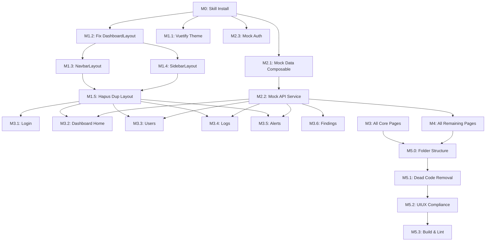

# MILESTONE-REFACTOR.md — Vue Log Analyzer Frontend Refactor

> **Project:** Vue Log Analyzer — LMS Log Analysis Dashboard for Cheating Detection
> **Stack:** Vue 3 + Vuetify 3 + Pinia + Vite
> **Design System:** [`docs/UIUX.md`](docs/UIUX.md)
> **Status:** 🟢 M5.0 Complete — P2 #5 Selesai

---

## 1. Current State Analysis

### 1.1 Layout Architecture — ✅ Fixed

| Issue | Severity | Status |
|-------|----------|--------|
| `DashboardLayout.vue` tanpa `<slot>` — konten child tidak pernah render | 🔴 Critical | ✅ Slot ditambahkan, layout sebagai parent route |
| Navbar + Sidebar duplikasi manual di 7 halaman | 🟡 Minor | ✅ Semua halaman via DashboardLayout parent route |
| `navbarLayout.vue` `onMounted` syntax error | 🔴 Critical | ✅ Fixed ke Composition API |
| Sidebar missing menu (Logs, Monitoring, Systems) | 🟡 Minor | ✅ Lengkap 10 menu items |

### 1.2 Inkonsistensi API & Environment

| Issue | Severity | Detail |
|-------|----------|--------|
| Env variable `URL_FLASK_API` tanpa prefix `VITE_` | 🟠 Medium | `user.vue`, `alerts.vue` — Vite tidak akan expose tanpa `VITE_` prefix |
| Hardcoded URLs | 🔴 Critical | `http://localhost:3000/` di `findings/[id].vue`, `http://180.250.135.11:8443/` di `downloads/[id].vue` |
| Firebase dependency tanpa fallback mock | 🟠 Medium | Auth tidak bisa jalan tanpa Firebase config valid |

### 1.3 UI/UX Melanggar UIUX.md

| Issue | Severity | Detail |
|-------|----------|--------|
| Theme default tanpa custom color palette | 🟠 Medium | Warna hardcoded (`blue`, `blue-accent-3`, `green`, `red`) |
| Typography inline tanpa utility classes | 🟡 Minor | `<h1>`, `<p>` tanpa `text-h4`, `text-body-1` dll |
| Aksesibilitas minimal | 🟠 Medium | Hampir semua icon button tanpa `aria-label` |
| Spacing tidak konsisten | 🟡 Minor | Campuran `pa-*`, `ma-*`, CSS manual, dan `style=""` |

### 1.4 Dead Code — ✅ Cleared (M5.0)

| File | Status |
|------|--------|
| `components/HelloWorld.vue` | ✅ Deleted |
| `components/backup.vue` | ✅ Deleted |
| `components/reporting.vue` | ✅ Deleted |
| `components/ex1.vue` | ✅ Deleted |
| `components/ex2.vue` | ✅ Deleted |
| `layouts/default.vue` + `layouts/default/` | ✅ Deleted |
| `pages/dashboard/chat.vue` | ✅ Deleted |
| `store/app.js` | ✅ Deleted |
| `styles/settings.scss` | ✅ Deleted (+ vite.config ref removed) |
| `firebase.js` | ✅ Moved to `services/firebase.js` |

### 1.5 Duplikasi Layout File — ✅ Deleted

| File | Status |
|------|--------|
| `layouts/dashboard/dashboardLayout.vue` (lowercase) | ✅ Deleted |
| `layouts/dashboard/navbarLayout.vue` (lowercase) | ✅ Deleted |
| `layouts/dashboard/sidebarLayout.vue` (lowercase) | ✅ Deleted |

### 1.6 Charts — ✅ Fixed (P2 #5)

| File | Issue | Status |
|------|-------|--------|
| `doghnut.vue` | Data random `Math.random()` | ✅ Ganti `useMockChartData()` + `<script setup>` |
| `linechart.vue` | Data random `Math.random()` | ✅ Ganti `useMockChartData()` + `<script setup>` |

---

## 2. Milestone Overview

```mermaid
gantt
    title Refactor Timeline
    dateFormat  YYYY-MM-DD
    section M0 Setup
    Skill Install & Config    :m0, 1d
    section M1 Foundation
    Layout Architecture       :m1a, after m0, 2d
    Vuetify Theme             :m1b, after m0, 1d
    section M2 Data Layer
    Mock Data & Services      :m2, after m1a, 2d
    section M3 Core Pages
    Login & Dashboard Home    :m3a, after m2, 2d
    Users & Logs              :m3b, after m3a, 2d
    Alerts & Findings         :m3c, after m3b, 2d
    section M4 Remaining
    Calendar & Monitoring     :m4a, after m3c, 2d
    Backup & Threshold        :m4b, after m4a, 1d
    section M5 Cleanup
    Folder Structure Cleanup  :m5a, after m4b, 1d
    Dead Code Removal         :m5b, after m5a, 1d
    Final Verification        :m5c, after m5b, 1d
```

| Milestone | Name | Target Selesai | Status |
|-----------|------|----------------|--------|
| **M0** | Project Setup & Skill Installation | — | ✅ Done |
| **M1** | Foundation — Layout & Theme | — | ✅ Done |
| **M2** | Data Layer — Mock API & Composables | — | 🟡 Partial (useMockData + useAuth done) |
| **M3** | Core Pages — Dashboard, Users, Logs | — | 🟡 Partial (Login + Dashboard Home P2#5 done) |
| **M4** | Remaining Pages | — | ⬜ Pending |
| **M5.0** | Folder Structure Cleanup | — | ✅ Done |
| **M5.1** | Dead Code Removal | — | 🟡 Partial (commented blocks in threshold.vue remain) |
| **M5.2** | UIUX.md Compliance Check | — | ⬜ Pending |
| **M5.3** | Lint & Build Verification | — | ✅ Build OK |

---

## 3. Milestone Details

### M0 — Project Setup & Skill Installation

**Goal:** Install OpenCode skills dan setup foundation tooling.

- [ ] Install `vue-log-analyzer-subagent-driven-development` skill (SKILL.md, implementer-prompt.md, task-reviewer-prompt.md, scripts)
- [ ] Verify semua skill terdaftar dengan prefix `vue-log-analyzer-`
- [ ] Setup `docs/superpowers/plans/` directory untuk implementation plans

**Files affected:**
- `.opencode/skills/vue-log-analyzer-subagent-driven-development/`
- `.opencode/skills/vue-log-analyzer-subagent-driven-development/implementer-prompt.md`
- `.opencode/skills/vue-log-analyzer-subagent-driven-development/task-reviewer-prompt.md`
- `.opencode/skills/vue-log-analyzer-subagent-driven-development/scripts/review-package`
- `.opencode/skills/vue-log-analyzer-subagent-driven-development/scripts/task-brief`
- `.opencode/skills/vue-log-analyzer-subagent-driven-development/scripts/sdd-workspace`

---

### M1 — Foundation: Layout Architecture & Theme

**Goal:** Fix layout system dan setup Vuetify theme sesuai UIUX.md.

#### M1.1 — Vuetify Theme Configuration

- [ ] Update `src/plugins/vuetify.js` dengan custom theme colors:

```js
theme: {
  defaultTheme: 'light',
  themes: {
    light: {
      colors: {
        primary: '#1565C0',
        secondary: '#FF8F00',
        accent: '#82B1FF',
        error: '#FF5252',
        info: '#2196F3',
        success: '#4CAF50',
        warning: '#FFC107',
        surface: '#FFFFFF',
        background: '#F5F5F5',
        'text-primary': 'rgba(0,0,0,0.87)',
        'text-secondary': 'rgba(0,0,0,0.60)',
        'text-disabled': 'rgba(0,0,0,0.38)',
      }
    }
  }
}
```

- [ ] Register `defaults` global Vuetify — default density, variant, dll:

```js
defaults: {
  VCard: { variant: 'elevated', elevation: 2 },
  VBtn: { variant: 'flat', rounded: 'lg' },
  VTextField: { variant: 'outlined', density: 'comfortable' },
  VDataTable: { density: 'comfortable', hover: true },
}
```

**Files affected:**
- `src/plugins/vuetify.js`

#### M1.2 — Fix DashboardLayout

- [ ] Tambah `<slot>` ke `dashboardLayout.vue`
- [ ] Integrasi `v-app-bar` (Navbar) dan `v-navigation-drawer` (Sidebar) langsung di layout
- [ ] Tambah breadcrumbs
- [ ] Setup responsive drawer (expand-on-hover, temporary on mobile)

```vue
<template>
  <v-layout>
    <NavbarLayout />
    <SidebarLayout />
    <v-main>
      <v-container fluid class="pa-6">
        <slot />
      </v-container>
    </v-main>
  </v-layout>
</template>
```

**Files affected:**
- `src/layouts/dashboard/dashboardLayout.vue`

#### M1.3 — Refactor NavbarLayout

- [ ] Fix `onMounted` syntax dari `onMounted: { ... }` menjadi `onMounted(() => { ... })`
- [ ] Gunakan `useAuthStore` dengan proper reactivity
- [ ] Implementasi UIUX.md section 6.5 (v-app-bar dengan flat, elevation 0)
- [ ] User menu dropdown dengan `v-menu`
- [ ] Real-time clock dengan `ref` reactive, bukan DOM langsung

**Files affected:**
- `src/layouts/dashboard/navbarLayout.vue`

#### M1.4 — Refactor SidebarLayout

- [ ] Gunakan `<script setup>` + Composition API
- [ ] Tambah menu items yang masih `#` (Courses, Activity)
- [ ] Tambah menu Monitoring, Systems yang belum ada
- [ ] Implementasi expand-on-hover
- [ ] Highlight active route
- [ ] Ikon konsisten pakai mdi

```js
items: [
  { text: 'Dashboard', icon: 'mdi-view-dashboard', url: '/dashboard' },
  { text: 'Users', icon: 'mdi-account-multiple', url: '/dashboard/user' },
  { text: 'Logs', icon: 'mdi-text-box-search', url: '/dashboard/logs' },
  { text: 'Alerts', icon: 'mdi-bell-alert', url: '/dashboard/alerts' },
  { text: 'Findings', icon: 'mdi-magnify-expand', url: '/dashboard/findings' },
  { text: 'Monitoring', icon: 'mdi-monitor-dashboard', url: '/dashboard/monitoring' },
  { text: 'Calendar', icon: 'mdi-calendar-month', url: '/dashboard/calendar' },
  { text: 'Backup', icon: 'mdi-cloud-download', url: '/dashboard/backup' },
  { text: 'Threshold', icon: 'mdi-speedometer', url: '/dashboard/threshold' },
  { text: 'Systems', icon: 'mdi-cog', url: '/dashboard/systems' },
]
```

**Files affected:**
- `src/layouts/dashboard/sidebarLayout.vue`

#### M1.5 — Hapus Duplikasi Layout dari Pages

- [ ] Remove `<NavbarLayout>` dan `<SidebarLayout>` dari:
  - `src/pages/dashboard/index.vue`
  - `src/pages/dashboard/user.vue`
  - `src/pages/dashboard/alerts.vue`
  - `src/pages/dashboard/calendar.vue`
  - `src/pages/dashboard/threshold.vue`
  - `src/pages/dashboard/systems.vue`
  - `src/pages/dashboard/downloads/[id].vue`
- [ ] Ganti dengan `<DashboardLayout>` wrapper

**Files affected:**
- Semua page files di `src/pages/dashboard/`

---

### M2 — Data Layer: Mock API & Composables

**Goal:** Buat mock data layer sehingga semua page bisa jalan tanpa backend Flask.

#### M2.1 — Mock Data Composable

- [ ] Buat `src/composables/useMockData.js` dengan fungsi:

| Fungsi | Return |
|--------|--------|
| `useMockSummary()` | `{ countUsers, countLogs, countAttempts, countFindings, recentActivity }` |
| `useMockUsers(count)` | Array of `{ id, firstName, lastName, email, quizName, timestart, timefinish, duration, score, status }` |
| `useMockLogs(count)` | Array of `{ logId, userId, action, component, courseName, ip, timecreated }` |
| `useMockAlerts(count)` | Array of `{ userId, firstName, lastName, timestart, timefinish, score, status, progress }` |
| `useMockFindings(count)` | Array of `{ userId, firstName, lastName, timestart, timefinish, timedate, duration, score, status }` |
| `useMockChartData()` | `{ donutLabels, donutData, lineLabels, lineData }` |
| `useMockCalendarEvents()` | Array of calendar events |
| `useMockBackupFiles()` | Array of `{ title, url, date }` |

- [ ] Gunakan `@faker-js/faker` (already in `devDependencies`) untuk generate data realistis
- [ ] Export data dengan `shallowRef` untuk performance

```js
import { faker } from '@faker-js/faker'
import { shallowRef } from 'vue'

export function useMockUsers(count = 50) {
  const users = shallowRef([])
  // generate users...
  return users
}
```

**Files affected:**
- `src/composables/useMockData.js` (NEW)

#### M2.2 — Mock API Service

- [ ] Buat `src/services/mockApi.js` sebagai service layer
- [ ] Fungsi mengembalikan Promise (simulasi async delay ~300ms)

```js
export const mockApi = {
  getSummary: () => new Promise(resolve => setTimeout(() => resolve({...}), 300)),
  getUsers: () => new Promise(resolve => setTimeout(() => resolve([...]), 300)),
  // ...
}
```

**Files affected:**
- `src/services/mockApi.js` (NEW)

#### M2.3 — Mock Auth

- [ ] Buat `src/composables/useMockAuth.js`
- [ ] Login: accept any email + password, simpan user mock di Pinia store
- [ ] Logout: clear store

```js
export function useMockAuth() {
  const login = (email, password) => {
    // Accept any, return simulated user
  }
  const logout = () => { ... }
  return { login, logout, user }
}
```

**Files affected:**
- `src/composables/useMockAuth.js` (NEW)

---

### M3 — Core Pages Refactor

**Goal:** Refactor semua halaman dengan layout baru, mock data, dan UIUX.md compliance.

#### M3.1 — Login Page

- [ ] Simplify `src/pages/login.vue` — hapus commented dead code block
- [ ] Gunakan mock auth (bisa toggle real vs mock via env)
- [ ] Implementasi form validation via `v-form`
- [ ] UIUX.md compliance: typography, spacing, accessibility
- [ ] Tambah error state handling

**Files affected:**
- `src/pages/login.vue`

#### M3.2 — Dashboard Home

- [ ] Refactor `src/pages/dashboard/index.vue`
- [ ] Stat cards: gunakan `v-col cols="12" sm="6" lg="3"` responsive grid
- [ ] Cards dengan ikon + value + label (bukan `<h1>` polos)
- [ ] Charts: ganti data random dengan mock meaningful data
- [ ] Data table proper dengan headers yang jelas
- [ ] Loading skeleton state

```vue
<v-row>
  <v-col v-for="stat in stats" :key="stat.label" cols="12" sm="6" lg="3">
    <v-card :color="stat.color" variant="tonal" class="pa-4">
      <v-icon :icon="stat.icon" size="large" class="mb-2" />
      <div class="text-h4 font-weight-bold">{{ stat.value }}</div>
      <div class="text-body-2 text-medium-emphasis">{{ stat.label }}</div>
    </v-card>
  </v-col>
</v-row>
```

**Files affected:**
- `src/pages/dashboard/index.vue`
- `src/components/doghnut.vue`
- `src/components/linechart.vue`

#### M3.3 — Users Page

- [ ] Refactor `src/pages/dashboard/user.vue`
- [ ] Fix env variable (`VITE_URL_FLASK_API` bukan `URL_FLASK_API`)
- [ ] Ganti axios call dengan mock API
- [ ] Status chip per user (Aman/Terindikasi)
- [ ] Responsive table dengan mobile-breakpoint

**Files affected:**
- `src/pages/dashboard/user.vue`

#### M3.4 — Logs Page

- [ ] Refactor `src/pages/dashboard/logs.vue`
- [ ] Ganti `<DashboardLayout>` (yang tadinya broken karena tanpa slot) — konten akan muncul
- [ ] Date picker dengan mock filter
- [ ] Loading state dengan `v-progress-circular`
- [ ] Error dialog untuk empty state

**Files affected:**
- `src/pages/dashboard/logs.vue`

#### M3.5 — Alerts Page

- [ ] Refactor `src/pages/dashboard/alerts.vue`
- [ ] Filter inputs (label, status select)
- [ ] Data table dengan status chip (Open/Closed/On Progress)
- [ ] Track progress column dengan `v-select`

**Files affected:**
- `src/pages/dashboard/alerts.vue`

#### M3.6 — Findings Page

- [ ] Refactor `src/pages/dashboard/findings/index.vue`
- [ ] Ganti `<DashboardLayout>` — konten akan muncul setelah slot fixed
- [ ] Date range picker + fetch button
- [ ] Data table dengan status chip (Dishonest/Honest)
- [ ] Download action per row
- [ ] Error dialog

**Files affected:**
- `src/pages/dashboard/findings/index.vue`

#### M3.7 — Findings Detail Page

- [ ] Refactor `src/pages/dashboard/findings/[id].vue`
- [ ] Fix hardcoded URL `http://localhost:3000/` → mock data
- [ ] Perbaiki export PDF dengan `html2pdf.js`
- [ ] Loading state sembari fetch data

**Files affected:**
- `src/pages/dashboard/findings/[id].vue`

---

### M4 — Remaining Pages Refactor

**Goal:** Refactor halaman sekunder yang lebih kecil.

#### M4.1 — Calendar Page

- [ ] Refactor `src/pages/dashboard/calendar.vue`
- [ ] `VCalendar` dengan mock events
- [ ] View mode selector (month/week/day)
- [ ] Weekday selector
- [ ] Event warna berbeda berdasarkan tipe

**Files affected:**
- `src/pages/dashboard/calendar.vue`

#### M4.2 — Monitoring Page

- [ ] Refactor `src/pages/dashboard/monitoring.vue`
- [ ] Integrasi `monitoringUser.vue` component
- [ ] Mock data untuk user steps / activity
- [ ] Real-time simulation (interval update)

**Files affected:**
- `src/pages/dashboard/monitoring.vue`
- `src/components/monitoringUser.vue`

#### M4.3 — Backup Page

- [ ] Refactor `src/pages/dashboard/backup.vue`
- [ ] Button backup dengan simulated progress
- [ ] Data table backup files dengan download link
- [ ] Notification dialog

**Files affected:**
- `src/pages/dashboard/backup.vue`
- `src/pages/dashboard/downloads/[id].vue`

#### M4.4 — Threshold Page

- [ ] Refactor `src/pages/dashboard/threshold.vue`
- [ ] Hapus commented dead code block
- [ ] Per-bidang card (Listening, Grammar, Reading)
- [ ] Masing-masing dengan input time + score
- [ ] Submit button dengan simulated save
- [ ] Responsive grid: `cols="12" md="4"`

**Files affected:**
- `src/pages/dashboard/threshold.vue`

#### M4.5 — Systems Page

- [ ] Isi `src/pages/dashboard/systems.vue` dengan konten bermakna
- [ ] System info cards (version, status, uptime simulated)
- [ ] Configuration panel (mock)

**Files affected:**
- `src/pages/dashboard/systems.vue`

---

### M5.0 — Folder Structure Cleanup

**Goal:** Hapus duplikasi file layout, dead code komponen, dan reorganisasi folder ringan.

#### M5.0.1 — Hapus Duplikasi Layout (P0)

- [ ] Hapus `src/layouts/dashboard/dashboardLayout.vue` (lowercase) — router pakai PascalCase
- [ ] Hapus `src/layouts/dashboard/navbarLayout.vue` (lowercase) — tidak direferensi
- [ ] Hapus `src/layouts/dashboard/sidebarLayout.vue` (lowercase) — tidak direferensi

**Files affected:**
- `src/layouts/dashboard/dashboardLayout.vue`
- `src/layouts/dashboard/navbarLayout.vue`
- `src/layouts/dashboard/sidebarLayout.vue`

#### M5.0.2 — Hapus Dead Component Files

- [ ] Hapus `components/HelloWorld.vue` — tidak dipakai
- [ ] Hapus `components/backup.vue` — stub, tidak dipakai
- [ ] Hapus `components/reporting.vue` — stub, tidak dipakai
- [ ] Hapus `components/ex1.vue` — stub, tidak dipakai
- [ ] Hapus `components/ex2.vue` — stub, tidak dipakai

**Files affected:**
- `src/components/HelloWorld.vue`
- `src/components/backup.vue`
- `src/components/reporting.vue`
- `src/components/ex1.vue`
- `src/components/ex2.vue`

#### M5.0.3 — Hapus Boilerplate / Dead Infra

- [ ] Hapus `layouts/default.vue` — tidak dipakai
- [ ] Hapus folder `layouts/default/` (AppBar.vue + View.vue) — tidak dipakai
- [ ] Hapus `pages/dashboard/chat.vue` — file 0 bytes
- [ ] Hapus `store/app.js` — file kosong
- [ ] Hapus `styles/settings.scss` — semua isi di-comment

**Files affected:**
- `src/layouts/default.vue`
- `src/layouts/default/AppBar.vue`
- `src/layouts/default/View.vue`
- `src/pages/dashboard/chat.vue`
- `src/store/app.js`
- `src/styles/settings.scss`

#### M5.0.4 — Reorganisasi Ringan

- [ ] Pindah `firebase.js` → `services/firebase.js` (tetap di-comment)
- [ ] Buat folder `components/charts/` — pindahkan `doghnut.vue` + `linechart.vue`
- [ ] Rename `doghnut.vue` → `DoughnutChart.vue` (fix typo), update import di `index.vue`
- [ ] Rename `linechart.vue` → `LineChart.vue`, update import di `index.vue`

**Files affected:**
- `src/services/firebase.js` (NEW — pindahan dari `firebase.js`)
- `src/components/charts/DoughnutChart.vue` (NEW — rename)
- `src/components/charts/LineChart.vue` (NEW — rename)
- `src/pages/dashboard/index.vue` (update import)
- `src/firebase.js` (DELETE setelah pindah)

---

### M5.1 — Dead Code Removal

**Goal:** Hapus kode mati dan commented blocks di halaman.

- [ ] Hapus commented dead code blocks di `login.vue`, `threshold.vue`
- [ ] Hapus imports yang tidak terpakai
- [ ] Normalisasi env variables (semua pakai `VITE_` prefix)

**Files affected:**
- `src/pages/login.vue`
- `src/pages/dashboard/threshold.vue`

### M5.2 — UIUX.md Compliance Check

**Goal:** Verifikasi semua halaman sesuai UIUX.md.

- [ ] **Theme:** Semua warna via theme variable, no hardcoded hex
- [ ] **Typography:** `text-h4`, `text-body-1` dll — no manual `<h1>` CSS
- [ ] **Spacing:** `pa-*`, `ma-*`, ga-* — no inline `style="padding:..."`
- [ ] **Buttons:** sesuai variant (flat/outlined/text) dan size (default/small/large)
- [ ] **Accessibility:** `aria-label` di semua icon-only button
- [ ] **Responsive:** `cols="12" sm="6" md="4" lg="3"` pattern
- [ ] **Icons:** Material Design Icons via `mdi-` prefix
- [ ] **Cards:** `pa-4` minimum, title `text-h6`
- [ ] **Forms:** `v-form` + validation, label + hint
- [ ] **Loading:** `v-progress-circular` atau skeleton

### M5.3 — Lint & Build Verification

**Goal:** Pastikan project bisa build tanpa error.

- [ ] Run `npm run lint` — fix errors
- [ ] Run `npm run build` — verify no build errors
- [ ] Final review against UIUX.md

---

## 4. File Map — Complete Refactor

### Files to Create (NEW)
```
src/composables/useMockData.js                # Mock data generator (faker.js)
src/composables/useMockAuth.js                # Mock authentication
src/services/mockApi.js                       # Mock API service layer
src/services/firebase.js                      # Firebase config (pindah + comment)
src/components/charts/DoughnutChart.vue       # ← doghnut.vue (rename + typo fix)
src/components/charts/LineChart.vue           # ← linechart.vue (rename)
```

### Files to Modify
```
src/plugins/vuetify.js                              # Theme customization
src/layouts/dashboard/DashboardLayout.vue           # Add <slot>, fix layout
src/layouts/dashboard/NavbarLayout.vue              # Fix onMounted, Composition API
src/layouts/dashboard/SidebarLayout.vue             # Missing menus, active route
src/pages/login.vue                                  # Cleanup, mock auth
src/pages/dashboard/index.vue                        # Update chart imports, mock data
src/pages/dashboard/user.vue                         # Fix env, mock data
src/pages/dashboard/logs.vue                         # Layout fix, mock data
src/pages/dashboard/alerts.vue                       # Remove dup layout, mock data
src/pages/dashboard/findings/index.vue               # Layout fix, mock data
src/pages/dashboard/findings/[id].vue                # Fix hardcoded URL, mock data
src/pages/dashboard/calendar.vue                     # Remove dup layout, mock data
src/pages/dashboard/monitoring.vue                   # Mock data
src/pages/dashboard/backup.vue                       # Layout fix, mock data
src/pages/dashboard/downloads/[id].vue               # Remove dup layout, mock data
src/pages/dashboard/threshold.vue                    # Remove dup layout, cleanup, mock
src/pages/dashboard/systems.vue                      # Content + mock data
src/components/monitoringUser.vue                    # Mock data
```

### Files to Delete (M5.0)
```
src/layouts/dashboard/dashboardLayout.vue             # Duplikat lowercase
src/layouts/dashboard/navbarLayout.vue                # Duplikat lowercase
src/layouts/dashboard/sidebarLayout.vue               # Duplikat lowercase
src/components/HelloWorld.vue                         # Dead — Vuetify template
src/components/backup.vue                             # Dead — stub
src/components/reporting.vue                          # Dead — stub
src/components/ex1.vue                                # Dead — stub
src/components/ex2.vue                                # Dead — stub
src/layouts/default.vue                               # Dead — boilerplate
src/layouts/default/AppBar.vue                        # Dead — boilerplate
src/layouts/default/View.vue                          # Dead — boilerplate
src/pages/dashboard/chat.vue                          # Dead — file 0 bytes
src/store/app.js                                      # Dead — file kosong
src/styles/settings.scss                              # Dead — semua comment
src/firebase.js                                       # Pindah ke services/
```

---

## 5. Implementation Order (Dependencies)



---

## 6. Progress Tracking

| Date | Milestone | Task | Status | Notes |
|------|-----------|------|--------|-------|
| 2026-06-21 | M0 | Install OpenCode skills (5 skills) | ✅ | Semua prefix `vue-log-analyzer-` |
| 2026-06-21 | M1.1 | Vuetify theme customization | ✅ | `plugins/vuetify.js` — colors + defaults |
| 2026-06-21 | M1.2 | Fix DashboardLayout with slot | ✅ | `<script setup>` + slot |
| 2026-06-21 | M1.3 | Refactor NavbarLayout | ✅ | Composition API, useAuth, clock fix |
| 2026-06-21 | M1.4 | Refactor SidebarLayout | ✅ | expand-on-hover, 10 menu, route active |
| 2026-06-21 | M1.5 | Hapus duplikasi layout dari pages | ✅ | 11 pages via parent route |
| 2026-06-21 | M2.1 | Mock data composable (faker) | ✅ | `useMockData.js` — semua fungsi |
| 2026-06-21 | M2.2 | Mock API service | ⬜ | Belum dibuat |
| 2026-06-21 | M2.3 | Mock auth composable | ✅ | `useAuth.js` + simplified `store/auth.js` |
| 2026-06-21 | M3.1 | Login page refactor | ✅ | Pakai useAuth, hapus Firebase/dead code |
| 2026-06-21 | M3.2 | Dashboard Home refactor | 🟡 Partial | Charts fixed (P2#5), stat cards mock fallback |
| 2026-06-21 | M3.3 | Users page refactor | ⬜ | |
| 2026-06-21 | M3.4 | Logs page refactor | ⬜ | |
| 2026-06-21 | M3.5 | Alerts page refactor | ⬜ | |
| 2026-06-21 | M3.6 | Findings page refactor | ⬜ | |
| 2026-06-21 | M3.7 | Findings detail refactor | ⬜ | URL fix done, mock data pending |
| 2026-06-21 | M4.1 | Calendar refactor | ⬜ | |
| 2026-06-21 | M4.2 | Monitoring refactor | ⬜ | Dead imports cleared, konten pending |
| 2026-06-21 | M4.3 | Backup + Downloads refactor | ⬜ | URL fix done (downloads) |
| 2026-06-21 | M4.4 | Threshold refactor | ⬜ | |
| 2026-06-21 | M4.5 | Systems page isi konten | ⬜ | |
| 2026-06-21 | M5.0.1 | Hapus duplikasi layout (lowercase) | ✅ | 3 file |
| 2026-06-21 | M5.0.2 | Hapus dead component files | ✅ | 5 file (HelloWorld, backup, reporting, ex1, ex2) |
| 2026-06-21 | M5.0.3 | Hapus boilerplate + dead infra | ✅ | 6 file (layouts/default, chat.vue, app.js, settings.scss) |
| 2026-06-21 | M5.0.4 | Reorganisasi ringan (services/) | ✅ | firebase.js → services/ (comment tetap) |
| 2026-06-21 | M5.0 | Fix monitoringUser.vue | ✅ | Hapus dead ex1/ex2 imports, layout refs |
| 2026-06-21 | M5.0 | Fix vite.config.mjs | ✅ | Remove settings.scss ref |
| 2026-06-21 | M5.1 | Dead code removal (commented blocks) | ⬜ | login.vue, threshold.vue |
| 2026-06-21 | M5.2 | UIUX.md compliance check | ⬜ | 10 poin |
| 2026-06-21 | M5.3 | Lint & build verification | ✅ | Build OK |

---

## 7. UIUX.md Quick Reference Card

```js
// Theme Colors (jangan hardcode!)
color="primary"     // #1565C0 - buttons, links, active
color="secondary"   // #FF8F00 - accents, badges
color="surface"     // #FFFFFF - cards, dialogs
color="error"       // #FF5252 - destructive
color="warning"     // #FFC107 - pending
color="success"     // #4CAF50 - confirmation
color="info"        // #2196F3 - informational

// Typography (jangan manual!)
text-h4   // 2.125rem / 500 — page titles
text-h5   // 1.5rem / 500   — section titles
text-h6   // 1.25rem / 500  — card headers
text-body-1 // 1rem / 400   — main content
text-body-2 // 0.875rem / 400 — secondary
text-caption // 0.75rem / 400 — helper
text-overline // 0.75rem / 500 — labels

// Spacing Scale (8px grid)
pa-1  // 4px   — tight (icon+text)
pa-2  // 8px   — small gaps
pa-3  // 12px  — form fields
pa-4  // 16px  — standard card padding
pa-6  // 24px  — page margins

// Button Variants
variant="flat"     // primary action
variant="outlined" // secondary action
variant="text"     // tertiary action

// Density
density="comfortable" // data-dense (tables, lists)
density="default"     // everything else
```

---

> **Document version:** 1.2
> **Last updated:** 2026-06-21
> **Author:** OpenCode AI — vue-log-analyzer refactor plan
>
> **Changelog v1.2:**
> - Updated semua status — M0, M1, M5.0 ✅ complete; M2 partial; M3/M4 pending
> - Updated section 1.1 — Layout Architecture ✅ Fixed (tambah slot, fix onMounted, sidebar lengkap)
> - Updated section 1.4 — Dead Code ✅ Cleared (10 file dihapus)
> - Updated section 1.5 — Duplikasi Layout ✅ Deleted (3 file lowercase)
> - Updated section 1.6 — Charts ✅ Fixed (P2 #5 — useMockChartData())
> - Updated progress tracking table — 20+ task real status
>
> **Changelog v1.1:**
> - Added M5.0 Folder Structure Cleanup (hapus duplikasi layout, dead components, boilerplate, reorganisasi ringan)
> - Updated section 1.4 Dead Code — diperluas dari 4 file menjadi 10 file
> - Added section 1.5 Duplikasi Layout File
> - Updated file map — ditambah files to delete (15 file) dan files to create (6 file)
> - Updated dependency graph — M5.0 sebagai prasyarat M5.1-M5.3
