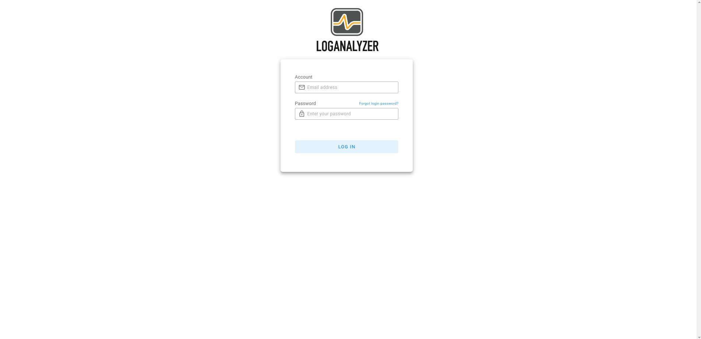
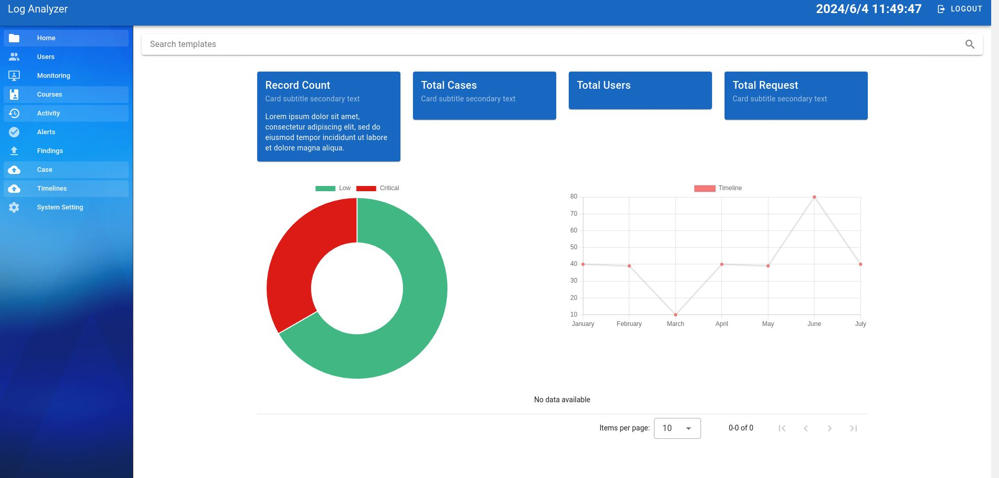

# Log Analyzer 
A log analyzer in a Learning Management System (LMS) environment is a tool designed to process and interpret log data generated by the LMS. Its main purposes are:

1. Monitoring Student Activity: Tracks student interactions with the LMS.
2. Identifying Patterns and Trends: Detects patterns that indicate engagement or potential cheating.
3. Performance Evaluation: Assesses the effectiveness of learning materials and teaching methods.
4. Ensuring Security and Integrity: Monitors for suspicious activities.

## Features
1. Data Collection: Gathers log data in real-time from various LMS components.
2. Data Preprocessing: Converts raw log data into a structured, standardized format.
3. Analysis and Visualization.
    - Descriptive analytics for summaries and statistics.
    - Behavioral analysis to identify student behavior patterns.
    - Anomaly detection for unusual patterns indicating issues.
## Images
| No | Image                                   | Url       |
|----|-----------------------------------------|-----------|
| 1  |         | /login    |
| 2  |                                         |  /dashboard   |
|        |       |     |
|        |       |     |


## 💿 Install

```
git clone https://github.com/yogiex/vue-log-analyzer
cd vue-log-analyzer
nvm use 16
npm install
npm run dev
```

npm run dev only for development

## 📑 License
[MIT](http://opensource.org/licenses/MIT)

Copyright (c) 2016-present Vuetify, LLC

## Todo list features
- [ ] Real time
