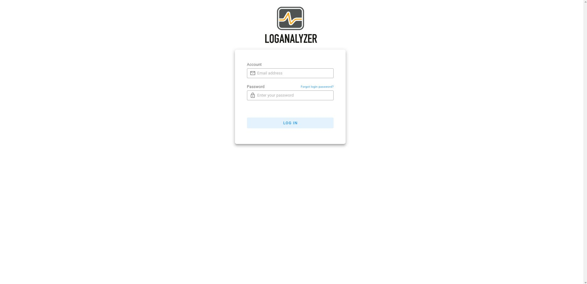
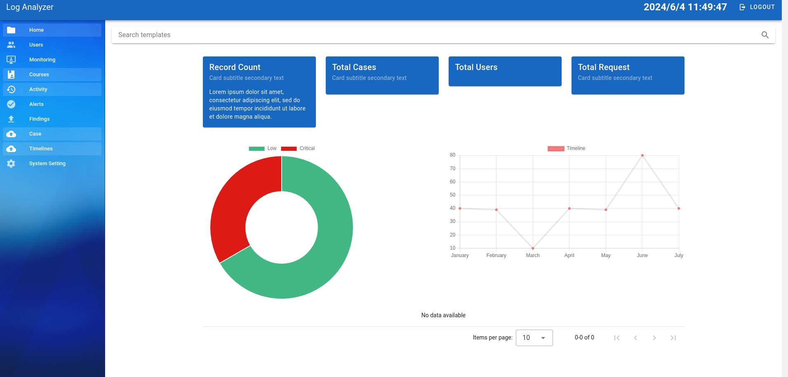
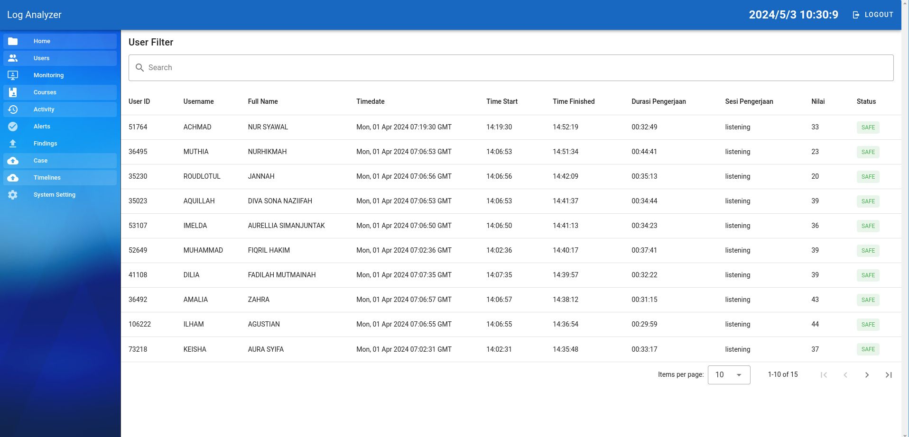
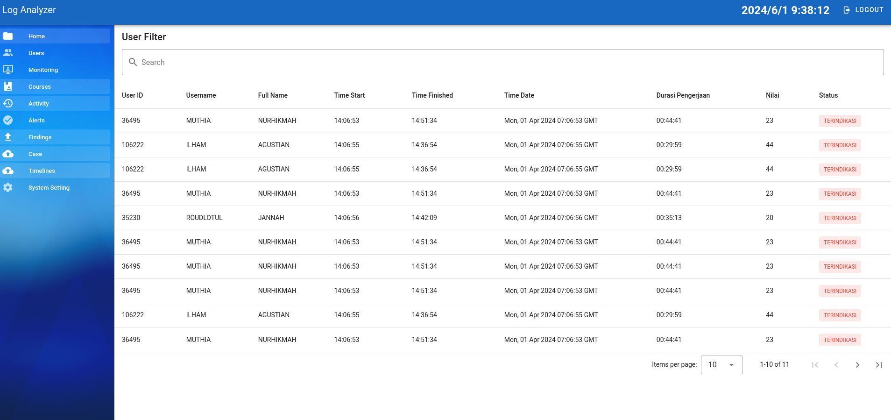
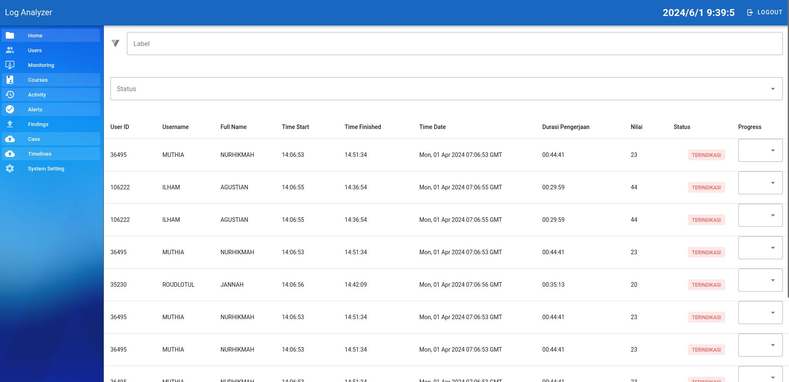
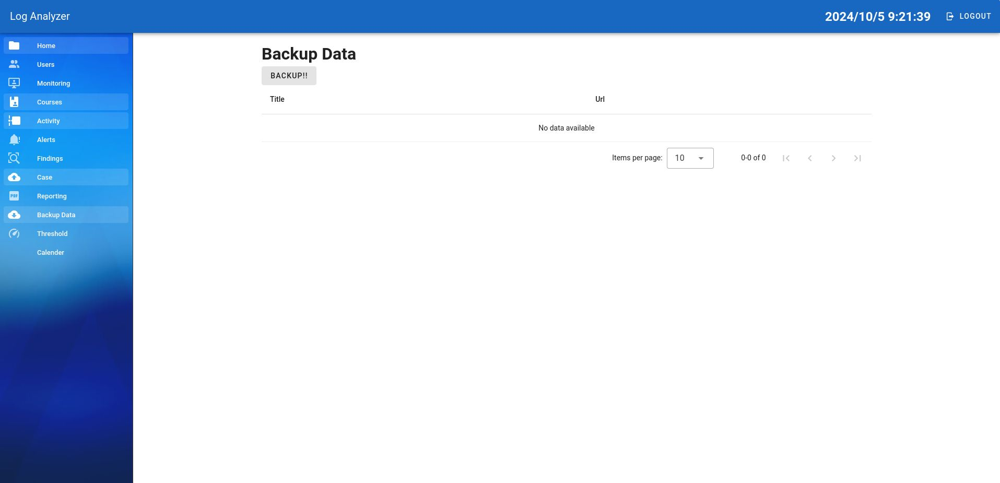

# Log Analyzer — Vue 3 + Vuetify 3 Dashboard

**Versi**: 1.0.0  
**Terakhir Diperbarui**: 2026-06-21  
**Status**: `Aktif`  
**Berlaku untuk**: Vue 3.3 + Vuetify 3.0

Dashboard untuk menganalisis log aktivitas mahasiswa dalam LMS (Learning Management System). Mendukung monitoring, deteksi anomali, dan visualisasi data secara real-time.

## Daftar Isi

1. [Fitur](#1-fitur)
2. [Tech Stack](#2-tech-stack)
3. [Struktur Proyek](#3-struktur-proyek)
4. [Instalasi](#4-instalasi)
5. [Penggunaan](#5-penggunaan)
6. [Backend](#6-backend)
7. [Tangkapan Layar](#7-tangkapan-layar)
8. [Lisensi](#8-lisensi)

---

## 1. Fitur

### Dashboard & Visualisasi

- **Statistik Ringkasan** — 4 kartu metrik (total user, quiz, anomali, percobaan).
- **Grafik Donat** — Distribusi sesi per shift dengan palet _colorblind-safe_.
- **Grafik Garis** — Tren percobaan per hari dengan area _fill gradient_.

### Manajemen Data

- Monitoring aktivitas mahasiswa secara _real-time_.
- Deteksi pola mencurigakan (anomali).
- Backup dan restore data percobaan.
- Sistem _reporting_ ke file.

### Keamanan

- **Guest Mode** — Login tanpa akun (penyimpanan via `localStorage`).
- **Firebase telah dihapus** — Tidak ada dependensi Firebase.

---

## 2. Tech Stack

| Kategori       | Teknologi                          |
| -------------- | ---------------------------------- |
| Framework      | Vue 3 (Composition API + `<script setup>`) |
| UI Library     | Vuetify 3                          |
| Routing        | Vue Router 4                       |
| State          | Pinia                              |
| Chart          | Chart.js 4 + vue-chartjs           |
| Ikon           | Material Design Icons (mdi)        |
| Build Tool     | Vite                               |
| Linting        | ESLint                             |
| Bahasa         | JavaScript (_.vue_ SFC)            |

> **💡 Catatan**: Proyek ini menggunakan **Vuetify 3**, bukan Vuetify 2. Semua props dan class mengikuti [dokumentasi Vuetify 3](https://vuetifyjs.com/en/).

---

## 3. Struktur Proyek

```
src/
├── App.vue                    # Root component + route transitions
├── main.js                    # Entry point
├── components/                # Komponen reusable
│   ├── doghnut.vue            #   Chart donat
│   ├── linechart.vue          #   Chart garis
│   └── monitoringUser.vue     #   Tabel monitoring user
├── composables/               # Logic reuse (Composition API)
│   ├── useAuth.js             #   Guest auth (localStorage)
│   └── useMockData.js         #   Data dummy (faker)
├── layouts/
│   └── dashboard/
│       ├── DashboardLayout.vue  # Layout utama (navbar + sidebar + router-view)
│       ├── NavbarLayout.vue     # App bar dengan jam & user menu
│       └── SidebarLayout.vue    # Navigasi drawer (10 menu)
├── pages/
│   ├── login.vue              # Halaman login
│   └── dashboard/             # 11 halaman dashboard
│       ├── index.vue          #   Beranda
│       ├── logs.vue           #   Log aktivitas
│       ├── monitoring.vue     #   Monitoring user
│       ├── user.vue           #   Manajemen user
│       ├── systems.vue        #   Sistem
│       ├── alerts.vue         #   Peringatan
│       ├── threshold.vue      #   Threshold
│       ├── calendar.vue       #   Kalender
│       ├── backup.vue         #   Backup data
│       ├── findings/          #   Temuan (index + detail)
│       └── downloads/         #   Unduhan (detail per ID)
├── plugins/
│   └── vuetify.js             # Konfigurasi tema Vuetify
├── router/
│   └── index.js               # Routing + auth guard
├── theme/
│   └── colors.js              # Token warna (19+ variabel)
└── store/                     # (cadangan, Pinia opsional)
```

---

## 4. Instalasi

### Prasyarat

- Node.js 18+ (disarankan 20 LTS)
- npm 9+

### Langkah

```bash
git clone https://github.com/yogiex/vue-log-analyzer
cd vue-log-analyzer
npm install
```

> **⚠️ Peringatan**: Jangan gunakan `nvm use 16`. Proyek ini membutuhkan Node.js 18+.

### Konfigurasi Environment

Buat file `.env` di root proyek:

```env
VITE_URL_FLASK_API=http://localhost:5000
```

---

## 5. Penggunaan

### Development

```bash
npm run dev
```

Akses di `http://localhost:5173`. Login menggunakan mode **Guest** (klik "Lanjutkan sebagai Tamu").

### Build Produksi

```bash
npm run build
npm run preview
```

### Linting

```bash
npm run lint
```

---

## 6. Backend

Backend Flask terpisah di folder `backend/`. Lihat [`backend/README.md`](backend/README.md) untuk detail.

### Persiapan Database

Gunakan MySQL dengan tabel-tabel berikut:

```sql
create table backup_attempt (
    id int auto_increment,
    attempt_id int,
    id_peserta int,
    firstname varchar(99),
    lastname varchar(250),
    course_name varchar(250),
    quiz_name varchar(250),
    unique_id int,
    layout longtext,
    timestart bigint(10),
    timefinish bigint(10),
    score decimal(10,5),
    primary key(id)
);
```

```sql
CREATE TABLE peserta_history (
    id SERIAL PRIMARY KEY,
    firstname VARCHAR(255) NOT NULL,
    lastname VARCHAR(255) NOT NULL,
    userid VARCHAR(255) NOT NULL,
    timedate TIMESTAMP DEFAULT CURRENT_TIMESTAMP,
    timestart TIME NULL DEFAULT NULL,
    timefinish TIME NULL DEFAULT NULL,
    timetaken TIME NULL DEFAULT NULL,
    score INT NOT NULL,
    _session VARCHAR(255) NOT NULL,
    _status INT NOT NULL,
    shift VARCHAR(255) NOT NULL,
    CONSTRAINT unique_timestamps UNIQUE (timedate)
);
```

```sql
CREATE TABLE case_history (
  cases longtext NOT NULL
);
```

```sql
CREATE TABLE daftar_proktor (
  chatid int NOT NULL
);
```

Jalankan `app.py` setelah database siap:

```bash
cd backend
python app.py
```

---

## 7. Tangkapan Layar

| No  | Halaman                | Gambar                                      |
| --- | ---------------------- | ------------------------------------------- |
| 1   | Login                  |             |
| 2   | Dashboard Beranda      |         |
| 3   | User                   |                  |
| 4   | Findings               |               |
| 5   | Alerts                 |                 |
| 6   | Backup Data            |            |

---

## 8. Lisensi

[MIT](http://opensource.org/licenses/MIT)

Copyright (c) 2024-present Vuetify, LLC
