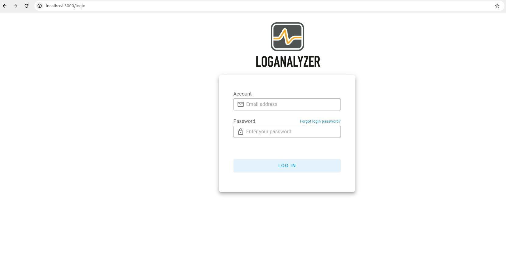

# Log Analyzer

A log analyzer in a Learning Management System (LMS) environment is a tool designed to process and interpret log data generated by the LMS. Its main purposes are:

1. Monitoring Student Activity: Tracks student interactions with the LMS.
2. Identifying Patterns and Trends: Detects patterns that indicate engagement or potential cheating.
3. Performance Evaluation: Assesses the effectiveness of learning materials and teaching methods.
4. Ensuring Security and Integrity: Monitors for suspicious activities.

## Features

1. Data Collection: Gathers log data in real-time from various LMS components.
2. Data Preprocessing: Converts raw log data into a structured, standardized format.
3. Analysis and Visualization.
   - Descriptive analytics for summaries and statistics.
   - Behavioral analysis to identify student behavior patterns.
   - Anomaly detection for unusual patterns indicating issues.

## Firebase Authenticator

We have integrated Firebase Authentication into this project to provide a more seamless and secure user experience. Firebase Auth allows users to:

1. Sign up: Create a new account with a strong email and password.
2. Log in: Log in to an existing account using various authentication methods.
3. Log out: Log out of their account at any time.
4. Forgot Password: Reset the password if forgotten.

## Images

| No  | Image                                | Url                 |
| --- | ------------------------------------ | ------------------- |
| 1   |      | /login              |
| 2   |  | /dashboard          |
| 3   |           | /dashboard/         |
| 4   |        | /dashboard/findings |
| 5   |          | /dashboard/alerts   |
| 6   |     | /dashboard/alerts   |

## 💿 Install

```
git clone https://github.com/yogiex/vue-log-analyzer
cd vue-log-analyzer
nvm use 16
npm install
npm run dev
```

npm run dev only for development

## Todo list features

- [ ] Real time
- [ ] Change
- [ ] System Reporting into file
- [x] Integrate with flask backend
- [x] Authentification login with firebase
- [x] Backup Data

## Backend

### Step by step

### Persiapan log storage

```sql
create table backup_attempt (
    id int auto_increment,
    attempt_id int,
    id_peserta int,
    firstname varchar(99),
    lastname varchar(250),
    course_name varchar(250),
    quiz_name varchar(250),
    unique_id int,
    layout longtext,
    timestart bigint(10),
    timefinish bigint(10),
    score decimal(10,5),
    primary key(id)
);
```

```sql
CREATE TABLE peserta_history (
    id SERIAL PRIMARY KEY, -- auto-incrementing primary key
    firstname VARCHAR(255) NOT NULL,
    lastname VARCHAR(255) NOT NULL,
    userid VARCHAR(255) NOT NULL,
    timedate TIMESTAMP DEFAULT CURRENT_TIMESTAMP,
    timestart TIME NULL DEFAULT NULL,
    timefinish TIME NULL DEFAULT NULL,
    timetaken TIME NULL DEFAULT NULL,
    score INT NOT NULL,
    _session VARCHAR(255) NOT NULL,
    _status INT NOT NULL,
    shift VARCHAR(255) NOT NULL,
    CONSTRAINT unique_timestamps UNIQUE (timedate)
);
```

```sql
CREATE TABLE case_history (
  cases longtext NOT NULL
);
```

```sql
CREATE TABLE daftar_proktor (
  chatid int NOT NULL
);
```

Setelah membuat db tersebut, langsung jalankan app.py

## 📑 License

[MIT](http://opensource.org/licenses/MIT)

Copyright (c) 2016-present Vuetify, LLC
