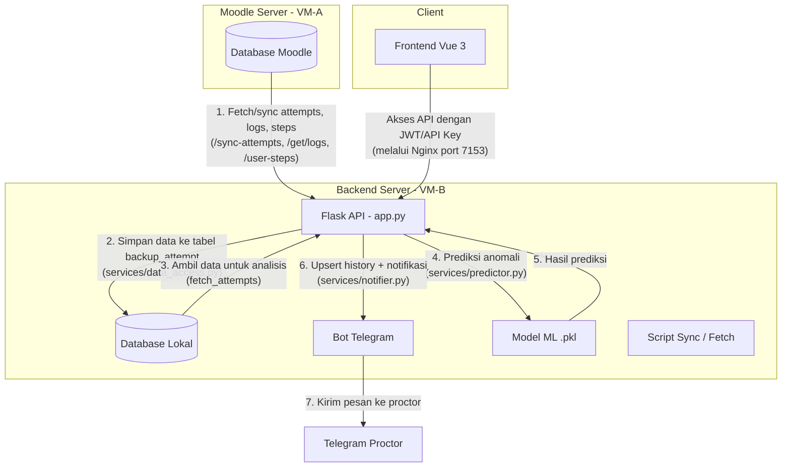

# EPrT Log Analyzer - Backend

Backend untuk monitoring dan deteksi indikasi kecurangan ujian EPrT pada LMS Moodle. Aplikasi mengambil data attempt, log, dan step pengerjaan soal, menjalankan model Isolation Forest, serta mengirim notifikasi Telegram ke proctor.

---

## 🧱 Arsitektur Sistem



**Alur Data:**

1. Data attempt, log, dan step dari **Moodle VM‑A** diambil melalui endpoint sinkronisasi atau pengambilan langsung.
2. Data disimpan ke **Database Lokal** (VM‑B) sebagai cadangan dan sumber analisis.
3. Saat analisis diminta, aplikasi mengambil data dari database lokal, memprosesnya dengan **Model Isolation Forest** (`.pkl`), dan memberikan label `aman` atau `terindikasi`.
4. Hasil disimpan ke tabel `peserta_history` dan jika ada indikasi kecurangan, **Bot Telegram** mengirim notifikasi ke proktor yang terdaftar.
5. **Frontend Vue 3** mengakses API melalui Nginx di port 7153 menggunakan autentikasi API Key atau JWT.

---

## 📁 Struktur Direktori

```
backend/
├── app.py                  # Entry point Flask
├── config.py               # Konfigurasi (database, threshold, path)
├── requirements.txt        # Dependensi Python
├── Dockerfile              # Docker image Flask (production)
├── Dockerfile.bot          # Docker image Telegram bot (terpisah)
├── docker-compose.yml      # Layanan backend + database + bot
│
├── routes/
│   ├── main.py             # Blueprint halaman utama
│   └── api.py              # Blueprint REST API (semua endpoint)
│
├── services/               # Lapisan bisnis
│   ├── database.py         # Koneksi database (VM‑A & VM‑B)
│   ├── data_access.py      # Query data (attempt, log, step, history)
│   ├── predictor.py        # Prediksi anomali (model Isolation Forest)
│   ├── threshold_manager.py # Pengaturan ambang batas
│   ├── auth.py             # Autentikasi (API Key + JWKS)
│   └── notifier.py         # Notifikasi Telegram
│
├── models/                 # Model ML (.pkl) yang sudah dilatih
├── keys/                   # Kunci JWKS (private & public)
├── scripts/                # Skrip bantu (SQL, bash)
├── templates/              # Template HTML (jika ada halaman server‑side)
├── static/                 # Aset statis
├── tests/                  # Pengujian unit
├── backup-files/           # Arsip kode lama (tidak digunakan di production)
└── backup-file/            # Folder penyimpanan hasil backup
```

---

## ⚙️ Prasyarat

- Python 3.11+
- MySQL / MariaDB (sudah ada data attempt dari Moodle)
- Docker & Docker Compose (opsional, untuk deployment)
- Token Bot Telegram (jika ingin notifikasi)

---

## 🚀 Instalasi

### 1. Clone repositori

```bash
git clone <url-repo>
cd vue-log-analyzer/backend
```

### 2. Buat virtual environment

```bash
python -m venv venv
source venv/bin/activate   # Linux/Mac
venv\Scripts\activate      # Windows
```

### 3. Install dependensi

```bash
pip install -r requirements.txt
```

### 4. Konfigurasi environment

Salin `.env.example` menjadi `.env` dan isi semua variabel:

```bash
cp .env.example .env
nano .env
```

Variabel yang wajib diisi:

- `MYSQL_HOST_VM_A`, `MYSQL_USER_VM_A`, `MYSQL_PASS_VM_A`, `MYSQL_DB_VM_A` → kredensial database Moodle (VM‑A)
- `hostname_source`, `db_username_source`, `password_source`, `database_source` → kredensial database lokal (VM‑B)
- `TOKEN_BOT_TELEGRAM` → token bot Telegram untuk notifikasi
- `API_KEY` → kunci statis untuk akses endpoint terproteksi

### 5. Siapkan model ML

Salin file `.pkl` yang diperlukan ke folder `models/`:

- `Grammar_iso_forest_model.pkl`
- `Listening_iso_forest_model.pkl`
- `Reading_iso_forest_model.pkl`

### 6. (Opsional) Generate kunci JWKS

```bash
cd keys
python generate_keys.py   # akan membuat private.pem & public.pem
```

### 7. Jalankan aplikasi (development)

```bash
python app.py
```

Aplikasi berjalan di `http://localhost:8443`.
Dokumentasi Swagger tersedia di `http://localhost:8443/docs/`.

---

## 🐳 Menjalankan dengan Docker

Pastikan Docker dan Docker Compose sudah terinstal.

```bash
docker-compose up -d
```

Ini akan menjalankan:

- **db** : MariaDB (tanpa port terbuka ke host)
- **flask** : Flask API di port 8443
- **bot** : Telegram bot (terpisah)

Log dapat dilihat dengan `docker-compose logs -f`.

---

## 📡 API Endpoint

| Method | Path                         | Deskripsi                             | Auth    |
| ------ | ---------------------------- | ------------------------------------- | ------- |
| GET    | `/api/daftar_peserta`        | Analisis attempt & deteksi kecurangan | API Key |
| GET    | `/api/peserta_history`       | Riwayat peserta                       | API Key |
| GET    | `/api/get_summary`           | Ringkasan statistik lokal             | API Key |
| GET    | `/api/api/get_cases`         | Semua kasus kecurangan                | API Key |
| GET    | `/api/detail_peserta`        | Detail peserta (anonim)               | API Key |
| POST   | `/api/treshold-settings`     | Ubah ambang batas                     | API Key |
| POST   | `/api/sync-attempts`         | Sinkronisasi attempt VM‑A→VM‑B        | API Key |
| GET    | `/api/get/logs`              | Log aktivitas VM‑A                    | API Key |
| GET    | `/api/user-steps`            | Data step pengerjaan soal             | API Key |
| GET    | `/api/summary`               | Ringkasan dashboard VM‑A              | API Key |
| GET    | `/api/directory/<path>`      | Jelajahi folder backup                | API Key |
| GET    | `/api/download/<path>`       | Unduh file backup                     | API Key |
| GET    | `/api/.well-known/jwks.json` | Public key JWKS                       | Publik  |
| POST   | `/api/auth/token`            | Menerbitkan JWT                       | API Key |

Semua endpoint (kecuali JWKS) memerlukan header `X-API-Key` atau `Authorization: Bearer <JWT>`.

---

## 🔐 Autentikasi

Sistem mendukung dua metode autentikasi:

1. **API Key** – header `X-API-Key` dengan nilai sesuai `API_KEY` di `.env`.
2. **JWT** – diperoleh dari `/api/auth/token` (setelah autentikasi dengan API Key), kemudian dikirim sebagai `Authorization: Bearer <token>`.

---

## 📊 Model Deteksi Kecurangan

Model Isolation Forest dilatih dengan fitur:

- Waktu pengerjaan (menit)
- Rasio penyelesaian (waktu / maksimal waktu)
- Skor akhir

Model di‑load dari file `.pkl` dan **hanya melakukan prediksi** (`predict`), bukan pelatihan ulang. Hasilnya digabung dengan aturan threshold yang dapat disesuaikan via API.

---

## ⚠️ Catatan Penting

- Jangan menjalankan `fit_predict` pada model yang sudah dilatih; gunakan `predict`.
- Semua query database sudah menggunakan parameterized statement.
- Folder `backup-files/` adalah arsip kode lama, **bukan bagian dari aplikasi yang berjalan**.
- Jika ingin mengekspos database ke host, ubah `docker-compose.yml` dengan hati‑hati.

---

## 📄 Lisensi

Proyek ini bersifat internal. Untuk informasi lebih lanjut, hubungi tim EPrT.
