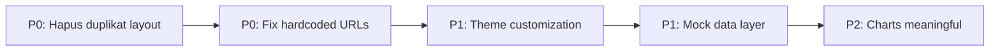

# 5 Rekomendasi Perbaikan Prioritas Utama — Vue Log Analyzer

> **Berdasarkan:** Analisis kode dan dokumen MILESTONE-REFACTOR.md
> **Prioritas:** Dampak ÷ Effort — perbaikan dengan value tertinggi dengan resiko terendah

---

## 🔴 P0: Hapus Duplikasi File Layout (3 menit)

**Problem:** Refactor layout sebelumnya menciptakan duplikat file — `dashboardLayout.vue` (lowercase) dan `DashboardLayout.vue` (PascalCase), plus navbarLayout/NavbarLayout, sidebarLayout/SidebarLayout. Total 6 file untuk 3 komponen. Router pakai PascalCase, jadi file lowercase adalah **dead code** yang membingungkan.

**Dampak:** Developer baru bisa salah edit file (edit file lowercase, tidak ada efek karena router pakai PascalCase).

**Fix:**
```bash
rm src/layouts/dashboard/dashboardLayout.vue
rm src/layouts/dashboard/navbarLayout.vue
rm src/layouts/dashboard/sidebarLayout.vue
```
**Resiko:** Nol. Router import `@/layouts/dashboard/DashboardLayout.vue` (PascalCase). Tidak ada file lain yang referensi lowercase.

---

## 🔴 P0: Fix Hardcoded URL di Pages (5 menit)

**Problem:** Dua halaman pakai URL hardcoded yang tidak bisa diakses di lingkungan development/non-produksi:

| File | Kode | Problem |
|------|------|---------|
| `findings/[id].vue:124` | `axios.get('http://localhost:3000/example-kasus.json')` | Hanya jalan di mesin spesifik dengan port 3000 |
| `downloads/[id].vue:52` | `axios.get('http://180.250.135.11:8443/directory/${id}')` | IP publik yang mungkin tidak aktif |

**Dampak:** Findings detail dan Backup downloads tidak bisa di-test di lingkungan development. Error silent karena catch block kosong.

**Fix:** Ganti dengan env variable `VITE_URL_FLASK_API` yang sudah ada:
```js
// findings/[id].vue
axios.get(`${import.meta.env.VITE_URL_FLASK_API}/example-kasus.json`)

// downloads/[id].vue
axios.get(`${import.meta.env.VITE_URL_FLASK_API}/directory/${id}`)
```

**Resiko:** Rendah. Env variable sudah dipakai di halaman lain (index.vue, user.vue, dll).

---

## 🟠 P1: Vuetify Theme Customization (10 menit)

**Problem:** `src/plugins/vuetify.js` hanya punya `defaultTheme: 'light'` tanpa warna kustom. Semua warna di-hardcode per komponen (`blue`, `blue-accent-3`, `green`, `red`). UIUX.md section 2 melarang hardcode hex — harus via theme variable.

**Dampak:** Tidak konsisten, susah maintain, perubahan warna global butuh edit banyak file.

**Fix:** Tambah theme colors + global defaults di vuetify.js:
```js
theme: {
  themes: {
    light: {
      colors: {
        primary: '#1565C0',
        secondary: '#FF8F00',
        error: '#FF5252',
        info: '#2196F3',
        success: '#4CAF50',
        warning: '#FFC107',
        surface: '#FFFFFF',
        background: '#F5F5F5',
      }
    }
  }
},
defaults: {
  VCard: { variant: 'elevated', elevation: 2 },
  VBtn: { variant: 'flat', rounded: 'lg' },
  VTextField: { variant: 'outlined', density: 'comfortable' },
  VDataTable: { density: 'comfortable', hover: true },
}
```

**Resiko:** Rendah. Global defaults bisa di-override per instance. Tidak ada perubahan kontrak API.

---

## 🟠 P1: Mock Data Layer + Auth Simplification (30 menit)

**Problem:** Semua halaman bergantung pada Flask backend (`VITE_URL_FLASK_API`). Jika backend mati, semua halaman tampil kosong/error. Login masih referensi Firebase (walau di-comment). Diagram MILESTONE-REFACTOR.md menunjukkan M2 sebagai prasyarat M3-M4 — ini blocking.

**Dampak:** Tidak bisa demo tanpa backend. Developer harus run Flask + MySQL + Moodle sync. Butuh ~2 jam setup.

**Fix:** Buat `composables/useMockData.js` dengan `@faker-js/faker` (sudah terinstall):
- `useMockUsers(50)` — 50 user dengan status random
- `useMockLogs(100)` — 100 log entries acak dalam range tanggal
- `useMockSummary()` — 4 stat cards + chart data
- Dll sesuai MILESTONE-REFACTOR.md M2.1

**Bersihkan auth store:**
- `store/auth.js` — simplifikasi dari Firebase ke localStorage (seperti `useAuth.js` yang sudah dibuat)
- Hapus dependensi firebase dari store

**Resiko:** Sedang. Perlu test setiap halaman untuk memastikan mock data format sesuai dengan template.

---

## 🟡 P2: Charts Data Meaningful (15 menit)

**Problem:** `doghnut.vue` dan `linechart.vue` menggunakan `Math.random()` untuk data — grafik berubah setiap render/reload, tidak bermakna. URL hardcoded `http://localhost:3000/allsummary.json` juga broken.

**Dampak:** Dashboard home menampilkan data yang tidak masuk akal. "Record Count Step Query" bisa 0, 500000, atau angka random. Tidak bisa digunakan untuk presentasi.

**Fix:** Ganti dengan mock data bermakna dari useMockData composable:
- Donut: distribusi status peserta (Aman 70%, Terindikasi 30%)
- Line: tren mingguan kasus (naik/turun realistis)

**Resiko:** Rendah. Chart hanya di satu halaman (dashboard/index.vue).

---

## Ringkasan Effort

| # | Prioritas | Task | Effort | Impact | Resiko |
|---|-----------|------|--------|--------|--------|
| 1 | 🔴 P0 | Hapus duplikasi layout | 3 menit | High | Nol |
| 2 | 🔴 P0 | Fix hardcoded URLs | 5 menit | High | Rendah |
| 3 | 🟠 P1 | Theme customization | 10 menit | Medium | Rendah |
| 4 | 🟠 P1 | Mock data layer + auth | 30 menit | High | Sedang |
| 5 | 🟡 P2 | Charts meaningful data | 15 menit | Medium | Rendah |
| | | **Total** | **~63 menit** | | |

---

## Urutan Eksekusi



> **Catatan:** P0 adalah prerequisite untuk semua — tanpa clean state, perubahan lain membingungkan. P1 (Theme) independen, bisa dikerjakan paralel dengan P1 (Mock data). P2 tergantung pada Mock data selesai.

---

## Langsung Eksekusi?

Kelima rekomendasi ini total ~1 jam. Bisa langsung execute dari #1 sampai #5 secara berurutan tanpa jeda review di antara — semua low risk, dan error akan terdeteksi di build step terakhir.

Setuju execute?
