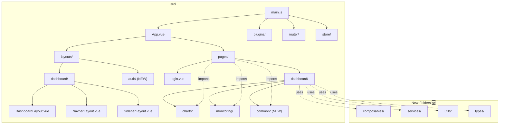

# Analisis Struktur Folder — Vue Log Analyzer Frontend

> **Dokumen:** Analisis struktur folder `src/` saat ini dan rekomendasi perbaikan
> **Project:** Vue 3 + Vuetify 3 + Pinia + Vite
> **Tanggal:** 2026-06-21

---

## 1. Current Structure (Before)

```
src/
├── App.vue                          # Root component (minimal)
├── main.js                          # Entry point (Firebase init + plugins)
├── firebase.js                      # Firebase config standalone (DUPLICATE init!)
│
├── assets/
│   ├── logo.png
│   └── logo.svg
│
├── components/                      # ❌ Flat, campur aduk, banyak file mati
│   ├── README.md
│   ├── HelloWorld.vue               # 🔴 DEAD — landing page template Vuetify preset
│   ├── backup.vue                   # 🔴 DEAD — cuma `<h1>tes</h1>`
│   ├── reporting.vue                # 🔴 DEAD — cuma `<h1>tes</h1>`
│   ├── ex1.vue                      # 🔴 DEAD — cuma `<h1>component sesi 1</h1>`
│   ├── ex2.vue                      # 🔴 DEAD — cuma `<h1>component sesi 2</h1>`
│   ├── doghnut.vue                  # 🟡 Chart component (dipakai di dashboard)
│   ├── linechart.vue                # 🟡 Chart component (dipakai di dashboard)
│   └── monitoringUser.vue           # ✅ Digunakan di halaman monitoring
│
├── layouts/                         # ❌ Dua layout, satu tidak dipakai
│   ├── README.md
│   ├── default.vue                  # 🔴 DEAD — Vuetify boilerplate, tidak dipakai
│   ├── default/
│   │   ├── AppBar.vue               # 🔴 DEAD — tidak dipakai
│   │   └── View.vue                 # 🔴 DEAD — tidak dipakai
│   └── dashboard/
│       ├── dashboardLayout.vue       # 🟡 Rusak — tidak punya <slot>
│       ├── navbarLayout.vue          # 🟡 Rusak — onMounted syntax error
│       └── sidebarLayout.vue         # 🟡 OK
│
├── pages/                           # ❌ Dashboard: campur page + subfolder
│   ├── README.md
│   ├── index.vue                    # 🟡 Root landing — cuma panggil HelloWorld
│   ├── login.vue                    # ✅ Login page
│   ├── register.vue                 # 🟡 Stub — tidak terhubung ke auth
│   └── dashboard/
│       ├── index.vue                # 🟡 Home — duplicated layout
│       ├── user.vue                 # 🟡 Duplicated layout
│       ├── logs.vue                 # 🟡 Broken layout (DashboardLayout tanpa slot)
│       ├── alerts.vue               # 🟡 Duplicated layout
│       ├── calendar.vue             # 🟡 Duplicated layout
│       ├── monitoring.vue           # 🟡 Minimal — cuma wrapper
│       ├── systems.vue              # 🟡 Stub — cuma `<h1>tes</h1>`
│       ├── chat.vue                 # 🔴 DEAD — file 0 bytes
│       ├── backup.vue               # 🟡 Broken layout
│       ├── threshold.vue            # 🟡 Duplicated layout + dead code
│       ├── downloads/
│       │   └── [id].vue             # 🟡 Duplicated layout + hardcoded URL
│       └── findings/
│           ├── index.vue            # 🟡 Broken layout
│           └── [id].vue             # 🟡 Broken layout + hardcoded URL
│
├── plugins/                         # ✅ Cukup rapi
│   ├── README.md
│   ├── index.js
│   └── vuetify.js                   # 🟡 Theme default — belum custom colors
│
├── router/
│   └── index.js                     # 🟡 Auto-routing — tidak ada route manual
│
├── store/                           # ❌ Satu store aktif, satu kosong
│   ├── README.md
│   ├── index.js                     # ✅ Pinia init
│   ├── app.js                       # 🔴 DEAD — file kosong (1 baris)
│   └── auth.js                      # ✅ Auth store (firebase)
│
└── styles/
    ├── README.md
    └── settings.scss                # 🔴 DEAD — semua isi di-comment
```

---

## 2. Ringkasan Masalah

### 🔴 Critical — Dead Code (7 file)

| File | Baris | Dampak |
|------|-------|--------|
| `components/HelloWorld.vue` | 92 | Tidak dipanggil oleh route mana pun, hanya `pages/index.vue` yang redirect ke sini |
| `components/backup.vue` | 3 | Stub — ada `pages/dashboard/backup.vue` asli |
| `components/reporting.vue` | 3 | Stub — tidak dipakai |
| `components/ex1.vue` | 3 | Stub — tidak dipakai |
| `components/ex2.vue` | 3 | Stub — tidak dipakai |
| `pages/dashboard/chat.vue` | 0 | File kosong — route mengarah ke halaman tidak berguna |
| `store/app.js` | 0 | File kosong — Pinia store tanpa state |

### 🟡 Structural — Misdirected Files (5 file)

| File | Masalah | Akibat |
|------|---------|--------|
| `firebase.js` | Firebase init di root `src/` | Dua inisialisasi Firebase (`main.js` juga init) — konflik |
| `layouts/default/` | Vuetify boilerplate tidak terpakai | Kebingungan developer mana layout yang aktif |
| `pages/index.vue` | Root landing page | Tidak konsisten dengan tema dashboard, langsung redirect ke HelloWorld |
| `styles/settings.scss` | Semua di-comment | Tidak ada kustomisasi Sass, Vuetify default polos |

### 🟡 Organizational — Missing Directories

| Direktori | Fungsi yang Hilang | Contoh |
|-----------|-------------------|--------|
| `composables/` | Shared stateful logic | `useMockData()`, `usePagination()`, `useDateFormat()` |
| `services/` | API layer terpusat | `api.js`, `mockApi.js` |
| `utils/` | Pure helper functions | `formatters.js`, `validators.js` |
| `types/` | TypeScript definitions | `user.ts`, `log.ts`, `alert.ts` |

### 🟡 Consistency — Naming Convention Issues

| Problem | Contoh |
|---------|--------|
| CamelCase vs kebab-case campur | `monitoringUser.vue` vs `doghnut.vue`, `linechart.vue` |
| File terpisah vs subfolder campur | `findings/index.vue` + `[id].vue` tapi `user.vue` flat |
| Nama ambigu | `backup.vue` di components vs pages — dua file berbeda |

---

## 3. Recommended Structure (After)

```
src/
├── App.vue
├── main.js
│
├── assets/
│   ├── images/
│   │   ├── logo.png
│   │   └── logo.svg
│   └── fonts/                    # Self-hosted fonts (jika perlu)
│
├── components/                   # 🔄 Organized by domain
│   ├── charts/
│   │   ├── DoughnutChart.vue     # ← doghnut.vue (diperbaiki)
│   │   └── LineChart.vue         # ← linechart.vue (diperbaiki)
│   ├── common/
│   │   ├── StatCard.vue          # Stat card reusable (NEW)
│   │   ├── PageHeader.vue        # Page title + breadcrumbs (NEW)
│   │   ├── EmptyState.vue        # Empty state component (NEW)
│   │   └── ConfirmDialog.vue     # Konfirmasi dialog reusable (NEW)
│   └── monitoring/
│       └── MonitoringUser.vue    # ← monitoringUser.vue (rename)
│
├── composables/                  # 🆕 NEW — shared logic
│   ├── useMockData.js            # Mock data generator (faker)
│   ├── useMockAuth.js            # Mock auth service
│   ├── useDashboard.js           # Dashboard state management
│   └── useDateFormat.js          # Date/time formatting helpers
│
├── layouts/                      # 🔄 Clean — hapus default/
│   ├── dashboard/
│   │   ├── DashboardLayout.vue   # ← dashboardLayout.vue (fixed)
│   │   ├── NavbarLayout.vue      # ← navbarLayout.vue (fixed)
│   │   └── SidebarLayout.vue     # ← sidebarLayout.vue
│   └── auth/
│       └── AuthLayout.vue        # Layout untuk login/register (NEW)
│
├── pages/                        # 🔄 Organized — hapus mati, kelompokkan
│   ├── login.vue
│   ├── register.vue
│   ├── index.vue                 # Landing / redirect
│   └── dashboard/
│       ├── index.vue             # Dashboard home (stat cards + charts)
│       ├── users.vue             # ← user.vue (rename plural)
│       ├── users/
│       │   └── [id].vue          # User detail (NEW — untuk future)
│       ├── logs.vue
│       ├── alerts.vue
│       ├── findings.vue          # ← findings/index.vue (flatten)
│       ├── findings/
│       │   └── [id].vue
│       ├── calendar.vue
│       ├── monitoring.vue
│       ├── settings/
│       │   ├── threshold.vue     # ← threshold.vue (group)
│       │   └── systems.vue       # ← systems.vue (group)
│       └── backup/
│           ├── index.vue         # ← backup.vue (group)
│           └── [id].vue          # ← downloads/[id].vue (group)
│
├── plugins/
│   ├── index.js
│   └── vuetify.js               # 🔄 Custom theme colors
│
├── router/
│   └── index.js                  # 🔄 Manual route definitions
│
├── services/                     # 🆕 NEW — API layer
│   ├── api.js                    # Axios instance + interceptors
│   ├── mockApi.js                # Mock data for MVP
│   └── firebase.js               # ← firebase.js (pindah ke sini)
│
├── store/                        # 🔄 Organized by domain
│   ├── index.js
│   ├── auth.js
│   ├── dashboard.js              # Summary statistics store (NEW)
│   ├── users.js                  # Users data store (NEW)
│   └── alerts.js                 # Alerts data store (NEW)
│
├── types/                        # 🆕 NEW — TypeScript definitions
│   ├── user.ts
│   ├── log.ts
│   ├── alert.ts
│   └── dashboard.ts
│
├── utils/                        # 🆕 NEW — pure functions
│   ├── formatters.js             # Date, number, string formatters
│   ├── validators.js             # Form validation rules
│   └── constants.js              # App-wide constants (API URLs, enums)
│
└── styles/
    ├── variables.scss            # 🔄 Custom Sass variables
    └── overrides.scss            # Vuetify overrides (jika perlu)
```

---

## 4. Mapping Rename — Current → Recommended

### Files to Rename / Move

| Current Path | Recommended Path | Alasan |
|-------------|------------------|--------|
| `firebase.js` | `services/firebase.js` | Pindah ke service layer |
| `components/doghnut.vue` | `components/charts/DoughnutChart.vue` | Subfolder + fix typo "doghnut" → "Doughnut" |
| `components/linechart.vue` | `components/charts/LineChart.vue` | Subfolder + PascalCase |
| `components/monitoringUser.vue` | `components/monitoring/MonitoringUser.vue` | Subfolder |
| `layouts/dashboard/dashboardLayout.vue` | `layouts/dashboard/DashboardLayout.vue` | PascalCase |
| `layouts/dashboard/navbarLayout.vue` | `layouts/dashboard/NavbarLayout.vue` | PascalCase |
| `layouts/dashboard/sidebarLayout.vue` | `layouts/dashboard/SidebarLayout.vue` | PascalCase |
| `pages/dashboard/user.vue` | `pages/dashboard/users.vue` | Plural + konsisten dengan resource |
| `pages/dashboard/findings/index.vue` | `pages/dashboard/findings.vue` | Flatten — satu folder untuk detail saja |
| `pages/dashboard/downloads/[id].vue` | `pages/dashboard/backup/[id].vue` | Group dengan backup |
| `store/app.js` | `store/dashboard.js` | Isi dengan dashboard state |

### Files to Delete

| File | Alasan |
|------|--------|
| `components/HelloWorld.vue` | Dead — Vuetify preset tidak terpakai |
| `components/backup.vue` | Dead — cuma `<h1>tes</h1>`, duplikasi fungsi |
| `components/reporting.vue` | Dead — cuma `<h1>tes</h1>` |
| `components/ex1.vue` | Dead — cuma `<h1>component sesi 1</h1>` |
| `components/ex2.vue` | Dead — cuma `<h1>component sesi 2</h1>` |
| `layouts/default.vue` | Dead — tidak digunakan |
| `layouts/default/AppBar.vue` | Dead — tidak digunakan |
| `layouts/default/View.vue` | Dead — tidak digunakan |
| `pages/dashboard/chat.vue` | Dead — file kosong |
| `styles/settings.scss` | Dead — semua di-comment |

### Files to Keep (No Change)

| File | Alasan |
|------|--------|
| `App.vue` | Root — minimal, OK |
| `main.js` | Entry point — OK |
| `assets/logo.png` | OK |
| `assets/logo.svg` | OK |
| `plugins/index.js` | Plugin registrar — OK |
| `plugins/vuetify.js` | Akan ditambahkan theme |
| `router/index.js` | Akan ditambahkan routes manual |
| `store/index.js` | Pinia init — OK |
| `store/auth.js` | Auth store — OK |
| `pages/login.vue` | Login — OK |
| `pages/register.vue` | Register — OK (bisa diperbaiki) |
| `pages/index.vue` | Landing — akan diperbaiki kontennya |

### Files to Create (NEW)

| Path | Fungsi |
|------|--------|
| `composables/useMockData.js` | Mock data generator |
| `composables/useMockAuth.js` | Mock auth |
| `composables/useDashboard.js` | Dashboard hooks |
| `composables/useDateFormat.js` | Date formatting |
| `services/api.js` | Axios instance |
| `services/mockApi.js` | Mock API |
| `services/firebase.js` | Firebase config |
| `utils/formatters.js` | Formatting helpers |
| `utils/validators.js` | Validation rules |
| `utils/constants.js` | Constants |
| `types/user.ts` | User type |
| `types/log.ts` | Log type |
| `types/alert.ts` | Alert type |
| `types/dashboard.ts` | Dashboard type |
| `components/common/StatCard.vue` | Reusable stat card |
| `components/common/PageHeader.vue` | Reusable header |
| `components/common/EmptyState.vue` | Empty state |
| `components/common/ConfirmDialog.vue` | Confirm dialog |
| `layouts/auth/AuthLayout.vue` | Auth page layout |
| `pages/dashboard/settings/threshold.vue` | Threshold (grouped) |
| `pages/dashboard/settings/systems.vue` | Systems (grouped) |
| `pages/dashboard/backup/index.vue` | Backup (grouped) |
| `pages/dashboard/backup/[id].vue` | Backup detail (grouped) |
| `store/dashboard.js` | Dashboard store |
| `store/users.js` | Users store |
| `store/alerts.js` | Alerts store |
| `styles/variables.scss` | Sass variables |
| `styles/overrides.scss` | Vuetify overrides |

---

## 5. Naming Convention Rules

Berdasarkan UIUX.md section 13, dan best practice Vue 3:

| Element | Convention | Contoh |
|---------|-----------|--------|
| **Component files** | PascalCase | `StatCard.vue`, `LineChart.vue`, `DashboardLayout.vue` |
| **Page files** | kebab-case | `users.vue`, `logs.vue`, `user-settings.vue` |
| **Composables** | `use` prefix + camelCase | `useMockData.js`, `useAuth.js` |
| **Services** | camelCase | `api.js`, `mockApi.js` |
| **Store files** | camelCase | `auth.js`, `dashboard.js` |
| **Folders** | kebab-case | `charts/`, `common/`, `monitoring/` |
| **Types** | PascalCase (file) | `User.ts`, `LogEntry.ts` |
| **Utils** | camelCase | `formatters.js`, `validators.js` |

---

## 6. Prioritas Implementasi

| Priority | Action | Files Affected | Effort |
|----------|--------|----------------|--------|
| P0 🔴 | Hapus dead files | 10 files | 5 menit |
| P1 🟡 | Buat struktur folder baru | 0 (mkdir) | 5 menit |
| P2 🟡 | Pindahkan `firebase.js` | 1 file | 2 menit |
| P3 🟡 | Buat `composables/` + `services/` + `utils/` | ~10 file baru | 30 menit |
| P4 🟢 | Rename component PascalCase | 3 file | 10 menit |
| P5 🟢 | Reorganize pages | 7 file | 20 menit |
| P6 🟢 | Buat `types/` | 4 file | 15 menit |

> **Total:** ~87 menit untuk restrukturisasi folder (belum termasuk refactor logic)

---

## 7. Visual Dependency



---

## 8. Checklist Final

Setelah restrukturisasi:

- [ ] Tidak ada file `.vue` di `components/` yang cuma `<h1>tes</h1>`
- [ ] `layouts/default/` sudah dihapus
- [ ] `pages/dashboard/chat.vue` sudah dihapus
- [ ] `firebase.js` sudah pindah ke `services/firebase.js`
- [ ] `store/app.js` sudah dihapus atau diisi
- [ ] `styles/settings.scss` sudah dihapus atau diisi
- [ ] Semua component files pakai PascalCase
- [ ] Folder structure menampilkan domain (charts/, common/, monitoring/)
- [ ] Ada folder `composables/`, `services/`, `utils/`, `types/`
- [ ] `npm run dev` masih jalan setelah restrukturisasi
